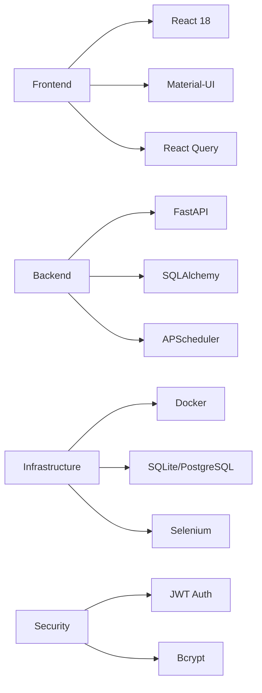

# WebMonitor

<p align="center">
  
  
  
  
  
</p>

<p align="center">
  
</p>

<h3 align="center">🚀 智能网页内容监控与实时通知平台</h3>

<p align="center">
  <strong>现代化</strong> • <strong>高可用</strong> • <strong>易部署</strong>
</p>

---

## 📖 关于项目

WebMonitor 是一个企业级的网页内容变化监控平台，采用现代化微服务架构设计，提供实时监控、智能分析和多渠道通知能力。

### ✨ 核心特性

- 🎯 **精准监控** - 基于 XPath 的精确内容定位
- 🔄 **实时检测** - 毫秒级内容变化识别
- 📧 **智能通知** - 多渠道邮件通知系统
- 👥 **企业级管理** - 完整的用户权限与角色管理
- 🔒 **安全可靠** - JWT 认证与数据加密
- 🐳 **容器化部署** - 一键 Docker 部署
- 📊 **可视化面板** - 现代化 React 管理界面
- ⚡ **高性能** - 支持大规模并发监控任务

## 🏗️ 技术栈



## 🚀 快速开始

### 🐳 Docker 部署 (推荐)

```bash
# 克隆项目
git clone https://github.com/qfpqhyl/WebMonitor.git
cd WebMonitor

# 一键启动
docker-compose up -d

# 访问应用
open http://localhost:3000
```

### 💻 本地开发

```bash
# 环境准备
git clone https://github.com/qfpqhyl/WebMonitor.git
cd WebMonitor

# 后端服务
cd backend && pip install -r requirements.txt && python main.py

# 前端服务
cd frontend && npm install && npm start
```

## 📋 系统要求

| 组件 | 最低要求 | 推荐配置 |
|------|----------|----------|
| Python | 3.9+ | 3.11+ |
| Node.js | 16+ | 18+ |
| 内存 | 2GB | 4GB+ |
| 存储 | 1GB | 5GB+ |
| Docker | 20.10+ | Latest |

## 🔧 配置说明

创建 `.env` 文件进行自定义配置：

```bash
# 核心配置
SECRET_KEY=your-secure-secret-key
DEBUG=false
DATABASE_URL=sqlite:///./data/webmonitor.db

# 邮件通知
SMTP_SERVER=smtp.example.com
SMTP_PORT=465
SMTP_USER=your-email@example.com
SMTP_PASSWORD=your-password

# 监控设置
DEFAULT_CHECK_INTERVAL=300
SELENIUM_HEADLESS=true
```

## 📊 功能模块

### 监控任务管理
- 多任务并发监控
- 自定义监控间隔
- XPath 精确定位
- 任务状态管理

### 用户权限系统
- 基于角色的访问控制 (RBAC)
- JWT 安全认证
- 用户活动审计

### 通知系统
- 多 SMTP 服务器支持
- 邮件模板自定义
- 通知规则配置

### 数据分析
- 监控历史记录
- 变化趋势分析
- 性能指标监控

## 🎯 使用场景

- **竞品监控** - 实时跟踪竞争对手动态
- **价格监控** - 电商价格变动提醒
- **内容更新** - 新闻资讯、公告更新
- **网站监控** - 服务可用性检查
- **SEO 监控** - 搜索引擎排名变化

## 🛠️ API 文档

启动服务后访问：
- **API 文档**: http://localhost:8000/docs
- **交互式测试**: http://localhost:8000/redoc

### 核心 API

```http
# 用户认证
POST /api/auth/login
POST /api/auth/register

# 监控任务
GET    /api/monitor-tasks
POST   /api/monitor-tasks
PUT    /api/monitor-tasks/{id}
DELETE /api/monitor-tasks/{id}

# 监控日志
GET /api/monitor-logs

# 邮件配置
GET    /api/email-configs
POST   /api/email-configs
```

## 📁 项目架构

```
WebMonitor/
├── 📦 backend/              # 后端服务
│   ├── 📂 app/
│   │   ├── 📂 api/         # API 路由层
│   │   ├── 📂 core/        # 核心配置
│   │   ├── 📂 db/          # 数据库层
│   │   ├── 📂 services/    # 业务逻辑层
│   │   └── 📂 schemas/     # 数据验证层
│   ├── 🚀 main.py          # 应用入口
│   └── 🐳 Dockerfile
├── 🎨 frontend/             # 前端应用
│   ├── 📂 src/
│   │   ├── 📂 components/  # React 组件
│   │   ├── 📂 pages/       # 页面组件
│   │   └── 📂 contexts/    # 状态管理
│   ├── 📄 package.json
│   └── 🐳 Dockerfile
├── 🐳 docker-compose.yml    # 容器编排
└── 📚 README.md
```

## 🔍 故障排除

### 常见问题

<details>
<summary>🔧 Docker 部署失败</summary>

```bash
# 检查容器状态
docker-compose ps

# 查看详细日志
docker-compose logs -f

# 重新构建
docker-compose down && docker-compose up -d --build
```
</details>

<details>
<summary>🔧 ChromeDriver 版本问题</summary>

```bash
# 进入容器检查
docker-compose exec backend chromium --version
docker-compose exec backend chromedriver --version

# 重新构建后端镜像
docker-compose build --no-cache backend
```
</details>

<details>
<summary>🔧 API 连接问题</summary>

```bash
# 检查网络连接
curl http://localhost:8000/health

# 检查 CORS 配置
curl -H "Origin: http://localhost:3000" http://localhost:8000/api/test
```
</details>

### 性能优化

- 使用 PostgreSQL 提升数据库性能
- 配置 Redis 缓存加速响应
- 启用 Nginx 负载均衡
- 调整 Selenium 并发数

## 🤝 贡献指南

我们欢迎所有形式的贡献！

### 开发流程

1. **Fork** 项目
2. **创建** 功能分支 (`git checkout -b feature/AmazingFeature`)
3. **提交** 更改 (`git commit -m 'Add some AmazingFeature'`)
4. **推送** 到分支 (`git push origin feature/AmazingFeature`)
5. **创建** Pull Request

### 代码规范

- 遵循 PEP 8 (Python)
- 遵循 ESLint 规则 (JavaScript)
- 编写单元测试
- 更新相关文档

## 📄 许可证

本项目采用 [Creative Commons Attribution-NonCommercial 4.0 International License](LICENSE) 许可证。

---

## 📞 支持

- 📧 **邮箱**: tianbosong2674@outlook.com
- 🐛 **问题反馈**: [GitHub Issues](https://github.com/qfpqhyl/WebMonitor/issues)
- 💬 **讨论**: [GitHub Discussions](https://github.com/qfpqhyl/WebMonitor/discussions)

---

<p align="center">
  <strong>⭐ 如果这个项目对你有帮助，请给我们一个 Star！</strong>
</p>

<p align="center">
  Made with ❤️ by WebMonitor Team
</p>
