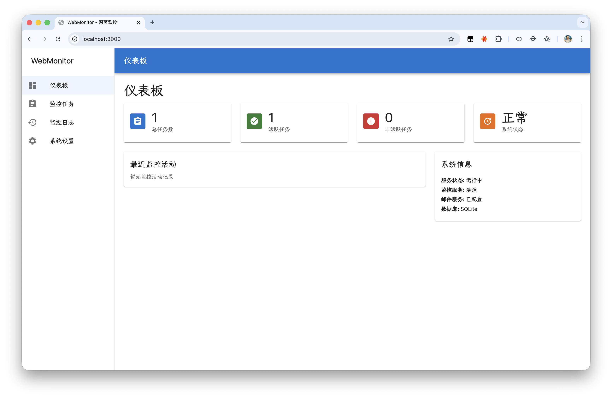

# WebMonitor

<h3 align="center">网页内容变化监控平台</h3>

<p align="center">
  
</p>

---

[English](./README.md) | 简体中文

## 在线体验

**访问地址**: https://webmonitor.qfpqhyl.top/

> 当前后端服务部署在维护者的 MacBook M4 Air 上，可用性会受到本地 Docker 运行状态影响。如需稳定使用，建议自行部署。

---

## 项目简介

WebMonitor 是一个基于 React 前端和 FastAPI 后端构建的网页内容监控与邮件通知平台。它可以通过 XPath 定位网页中的指定区域，检测内容变化，并在发生变化时自动发送邮件提醒。

## 主要功能

- 基于 XPath 精确监控网页内容变化
- 检测到变化后自动发送邮件通知
- 支持公开任务与用户订阅机制
- 提供任务、日志、用户和系统设置的可视化管理界面
- 支持 Docker 部署
- 前端支持中文和英文双语切换

---

## 技术栈

**前端**
- React
- Material UI
- React Query
- Axios
- react-i18next

**后端**
- FastAPI
- SQLAlchemy
- APScheduler
- Selenium WebDriver

**部署**
- Docker
- Docker Compose
- 默认使用 SQLite，生产环境支持 PostgreSQL

---

## 快速开始

### Docker 部署

```bash
git clone https://github.com/qfpqhyl/WebMonitor.git
cd WebMonitor
docker-compose up -d
```

启动后访问：
- 前端: http://localhost:3000
- 后端 API: http://localhost:8000
- API 文档: http://localhost:8000/docs

默认管理员账号：
- 用户名: `admin`
- 密码: `admin123`

### 本地开发

后端：

```bash
cd backend
pip install -r requirements.txt
python main.py
```

前端：

```bash
cd frontend
npm install
npm start
```

---

## 环境变量配置

复制 `.env.example` 为 `.env`，再按需修改配置。

### 核心配置项

| 变量 | 说明 | 默认值 |
| --- | --- | --- |
| `SECRET_KEY` | JWT 签名密钥，生产环境必须修改 | - |
| `ADMIN_USERNAME` | 默认管理员用户名 | `admin` |
| `ADMIN_PASSWORD` | 默认管理员密码 | `admin123` |
| `ADMIN_EMAIL` | 默认管理员邮箱 | `admin@example.com` |
| `FRONTEND_URL` | 前端访问地址 | `http://localhost:3000` |
| `DATABASE_URL` | 数据库连接字符串 | `sqlite:///./data/webmonitor.db` |
| `SMTP_SERVER` | 通知邮件使用的 SMTP 服务器 | - |
| `SMTP_PORT` | SMTP 端口 | `465` |
| `SMTP_USER` | SMTP 用户名 | - |
| `SMTP_PASSWORD` | SMTP 密码或应用专用密码 | - |
| `DEFAULT_CHECK_INTERVAL` | 默认监控间隔（秒） | `300` |

完整配置模板请查看 `.env.example`。

---

## 使用场景

- 跟踪商品价格变化
- 监控网站公告或政策更新
- 关注竞品页面动态
- 监控任何对业务或个人工作流重要的网页区域

---

## 项目结构

```text
backend/   FastAPI API、数据库模型、业务服务、调度器
frontend/  React 应用、页面组件、国际化资源
image/     文档使用的截图与素材
```

---

## 架构概览

1. React 前端通过 Axios 调用 FastAPI 后端。
2. 系统使用 JWT 进行身份认证。
3. 监控任务通过 SQLAlchemy 持久化到数据库。
4. APScheduler 在后台调度监控任务。
5. Selenium 负责加载并检查目标网页内容。
6. 检测到变化后，系统发送邮件通知。

---

## 文档

- English documentation: [README.md](./README.md)
- 后端 API 文档: `http://localhost:8000/docs`

---

## 许可证

[CC BY-NC 4.0](LICENSE) - 仅供个人和非商业用途使用。

---

<p align="center">
  Made by 秋风飘起黄叶落
</p>
